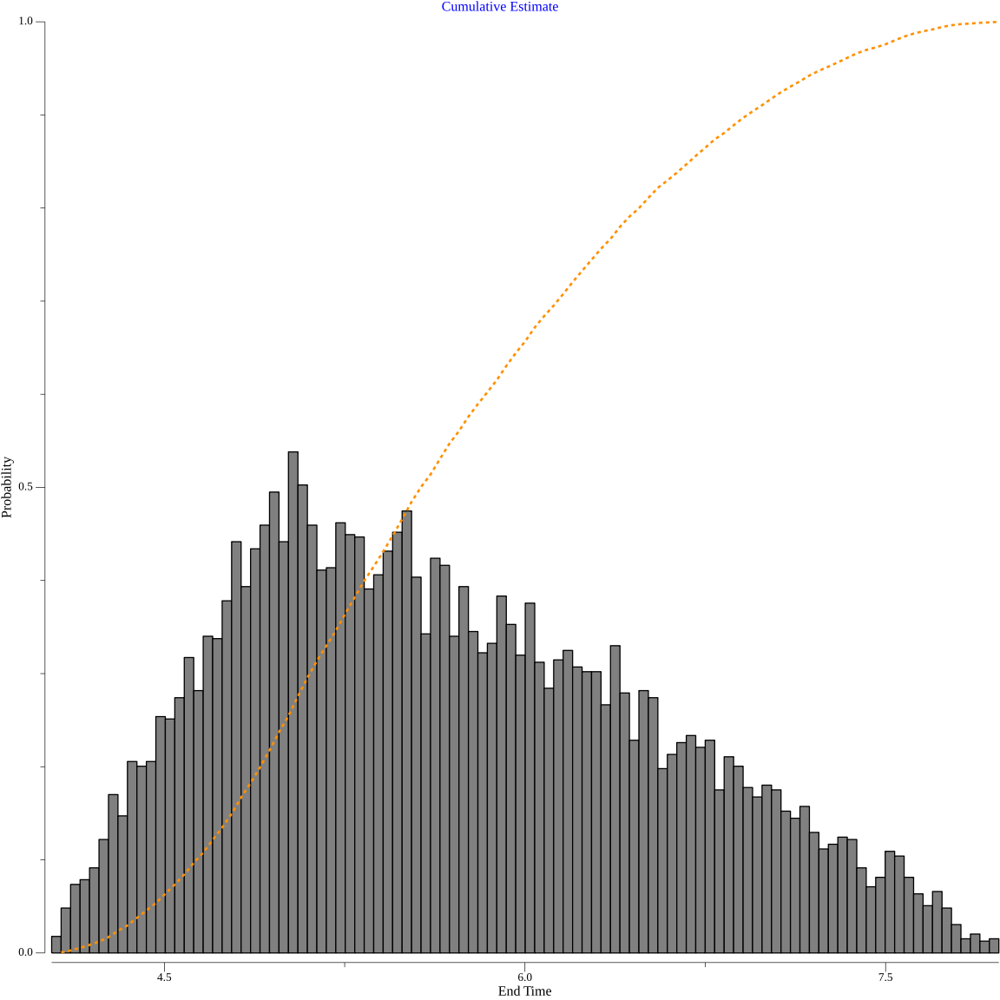

## goestimate

Command line tool that:

1. Reads a JSON execution plan of gonum [distributions](https://pkg.go.dev/gonum.org/v1/gonum/stat/distuv) distributions.
    - Operations can be arbitrarily nested and both serial and parallel execution is supported. 
2. Creates a gonum [graph](https://pkg.go.dev/gonum.org/v1/gonum/graph) where nodes represent generator events.
3. Runs a Monte Carlo simluation of all generators.
4. Computes the execution's [critical path](https://en.wikipedia.org/wiki/Critical_path_method).
5. Generates a [D2](https://d2lang.com/) representation and SVG image that includes denoting the critical path.

## Example

Input

```json
{
    "name": "My Project",
    "runCount": 10000,
    "activities": {
        "tasks": [
            {
                "name": "DesignDoc",
                "type": "PERT(4,5,8)"
            }
        ]
    }
}
```

Output


The final arrow points to a histogram of expected completion times:



## Example - workdays

To produce a workday calendar aware completion date, add `workdays:true` key to the JSON definition.

```json
{
    "name": "My Project",
    "runCount": 10000,
    "workdays" : true,
    "activities": {
        "tasks": [
            {
                "name": "DesignDoc",
                "type": "PERT(4,5,8)"
            }
        ]
    }
}
```


## Control Flow

There are no reserved keynames in an _activities_ object. `goestimate` makes
the following inferences:

- Key values that scope arrays are assumed to define serial tasks
- Key values that define objects are assumed to be parallel operations unless they include `name` and `activities` keys, in which case they are treated as subgraphs. Subgraphs are output as nested [D2 Containers](https://d2lang.com/tour/containers/).

For instance, the [workflow.json](https://raw.githubusercontent.com/mweagle/goestimate/main/examples/workflow.json)
definition produces a more complex representation:


## Supported Distributions

[PERT](https://en.wikipedia.org/wiki/PERT_distribution) and [Pareto](https://en.wikipedia.org/wiki/Pareto_distribution)
are the most useful for estimation.

## TODO

- Better docs
- Espose more D2 formatting options (ex: [sketch mode](https://d2lang.com/tour/sketch/))
- Support D2 [Composition](https://d2lang.com/tour/composition)
- Update formatting of summary histogram, CDF
- Color code vertices based on amount of slack similar to 
    [COLORED NETWORK DIAGRAMS (PART 1)](https://caipirinha.spdns.org/wp/?p=565) 